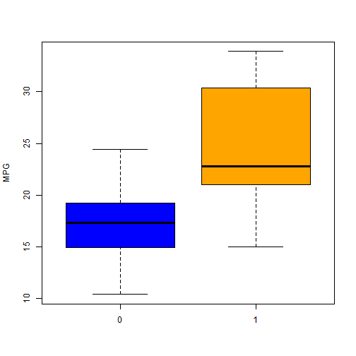
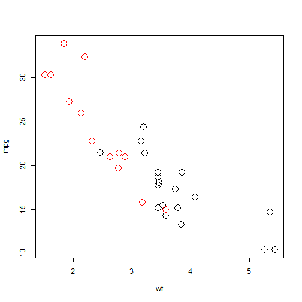
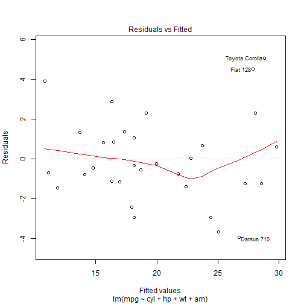
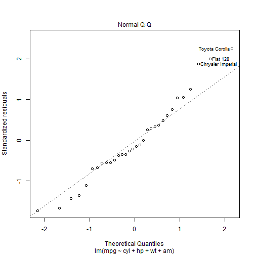
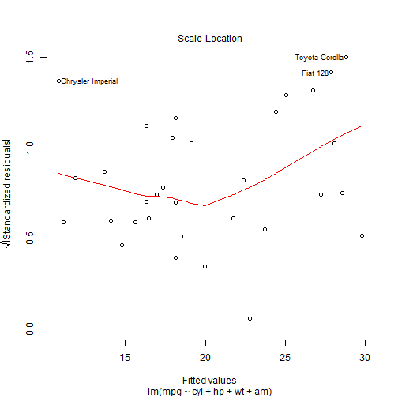
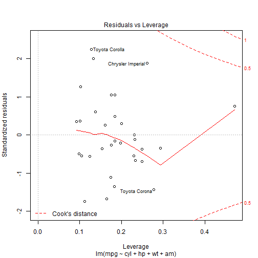

Regression Models Project
========================================================
Executive summary.
--------------------------------------------------------
Motor Trend, a magazine about the automobile industry is looking at a data set of a collection of cars, they are interested in exploring the relationship between a set of variables and miles per gallon (MPG) 
(outcome). They are particularly interested in the following two questions:

* “Is an automatic or manual transmission better for MPG”
* “Quantifying how different is the MPG between automatic and manual transmissions?”

In oreder to answer the questions, I built a linear regression models and did the analysis. My final conclusion is included in the __Final Conclusion__ section. I disscussed more in the __More section__.

Methodologies
-------------------------------------------------------
For the obvious reason, we need to build a regression model here. But let's explore on data first.

```r
data(mtcars) # prepare the data first
for (i in c(2, 8, 9, 10, 11)) {
  mtcars[,i] <- as.factor(mtcars[, i])
}
str(mtcars)
```

```
## 'data.frame':	32 obs. of  11 variables:
##  $ mpg : num  21 21 22.8 21.4 18.7 18.1 14.3 24.4 22.8 19.2 ...
##  $ cyl : Factor w/ 3 levels "4","6","8": 2 2 1 2 3 2 3 1 1 2 ...
##  $ disp: num  160 160 108 258 360 ...
##  $ hp  : num  110 110 93 110 175 105 245 62 95 123 ...
##  $ drat: num  3.9 3.9 3.85 3.08 3.15 2.76 3.21 3.69 3.92 3.92 ...
##  $ wt  : num  2.62 2.88 2.32 3.21 3.44 ...
##  $ qsec: num  16.5 17 18.6 19.4 17 ...
##  $ vs  : Factor w/ 2 levels "0","1": 1 1 2 2 1 2 1 2 2 2 ...
##  $ am  : Factor w/ 2 levels "0","1": 2 2 2 1 1 1 1 1 1 1 ...
##  $ gear: Factor w/ 3 levels "3","4","5": 2 2 2 1 1 1 1 2 2 2 ...
##  $ carb: Factor w/ 6 levels "1","2","3","4",..: 4 4 1 1 2 1 4 2 2 4 ...
```

```r
boxplot(data = mtcars, mpg ~ am, ylab = 'MPG', col = c('blue', 'orange'))
```

 

Only by examing the box plot, it is clear that the MPG of an automatic transmission is __higher__ than a manual transmission. But is this the answer? No.

Models
---------------------------------------------------------
Let's start by building some models.

```r
with(mtcars,plot(y = mpg,x = wt, col = am, cex =2))
```

 

```r
mod2 <- lm(data = mtcars, mpg ~ wt + am) # new model with two vars.
summary(mod2)
```

```
## 
## Call:
## lm(formula = mpg ~ wt + am, data = mtcars)
## 
## Residuals:
##    Min     1Q Median     3Q    Max 
## -4.530 -2.362 -0.132  1.403  6.878 
## 
## Coefficients:
##             Estimate Std. Error t value Pr(>|t|)    
## (Intercept)  37.3216     3.0546   12.22  5.8e-13 ***
## wt           -5.3528     0.7882   -6.79  1.9e-07 ***
## am1          -0.0236     1.5456   -0.02     0.99    
## ---
## Signif. codes:  0 '***' 0.001 '**' 0.01 '*' 0.05 '.' 0.1 ' ' 1
## 
## Residual standard error: 3.1 on 29 degrees of freedom
## Multiple R-squared:  0.753,	Adjusted R-squared:  0.736 
## F-statistic: 44.2 on 2 and 29 DF,  p-value: 1.58e-09
```

```r
new2 <- data.frame(wt = c(2.62, 2.62), am = as.factor(c(1,0)) )
(pre2 <- predict(mod2, new = new2))
```

```
##     1     2 
## 23.27 23.30
```

From plot above,clearly, weight is coreleated with am. So there may be confounding variables in our data set and We have to find a way find and remove them. The most easiest way is to do a __variable selection__ with the step() function.


```r
mod3 <- step(lm(data = mtcars, mpg ~ .), trace = 0) # the backward selection
summary(mod3)
```

```
## 
## Call:
## lm(formula = mpg ~ cyl + hp + wt + am, data = mtcars)
## 
## Residuals:
##    Min     1Q Median     3Q    Max 
## -3.939 -1.256 -0.401  1.125  5.051 
## 
## Coefficients:
##             Estimate Std. Error t value Pr(>|t|)    
## (Intercept)  33.7083     2.6049   12.94  7.7e-13 ***
## cyl6         -3.0313     1.4073   -2.15   0.0407 *  
## cyl8         -2.1637     2.2843   -0.95   0.3523    
## hp           -0.0321     0.0137   -2.35   0.0269 *  
## wt           -2.4968     0.8856   -2.82   0.0091 ** 
## am1           1.8092     1.3963    1.30   0.2065    
## ---
## Signif. codes:  0 '***' 0.001 '**' 0.01 '*' 0.05 '.' 0.1 ' ' 1
## 
## Residual standard error: 2.41 on 26 degrees of freedom
## Multiple R-squared:  0.866,	Adjusted R-squared:  0.84 
## F-statistic: 33.6 on 5 and 26 DF,  p-value: 1.51e-10
```

```r
new3 <- data.frame(wt = c(2.62, 2.62), hp = c(110,110), cyl  = as.factor(c(8,8)), am = as.factor(c(0,1)))
(pre3 <- predict(mod3, new = new3))
```

```
##     1     2 
## 21.47 23.28
```

Let plot some diagnostic plots to make sure our final mode is valid. Check the appendix for the figures.
The model looks good enough to me. The residuals split quite randomly,the normality is also ensured by the QQ plot and no obvious outliners. Now we can do the final analysis via the mod3. * The p-value for am .2, far away from 0.05. This indicates that the transmission might not be a important indicator for mpg.
* Holding the other variables in the model constant, the difference mpg between AT and MT is not that hugh.

Final Conclusion
----------------------------------------------------------------
So now we can finally answer the two questions at the very beginning.

* “Is an automatic or manual transmission better for MPG” -- No. There is no difference.
* “Quantifying how different is the MPG between automatic and manual transmissions?” 0

More ...
-----------------------------------------------------------------
Look back at the scatter plot of mpg, wt and am. There are clearly two clusters in the picture. So if people think the mpg of a AT car is higher, the most reasonable explanation is that somehow the average weight of AT cars is __smaller__ than the weight of MT cars. And the heavier a car is, the smaller its mpg is.

Appendix
-------------------------------------------------------------
    
